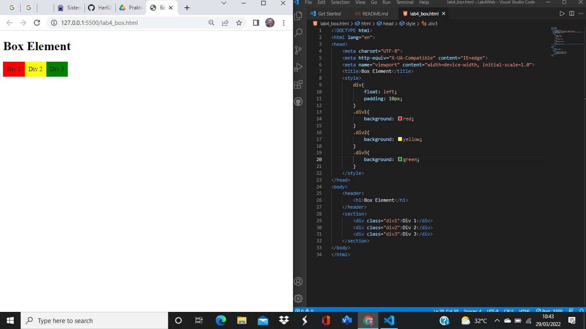
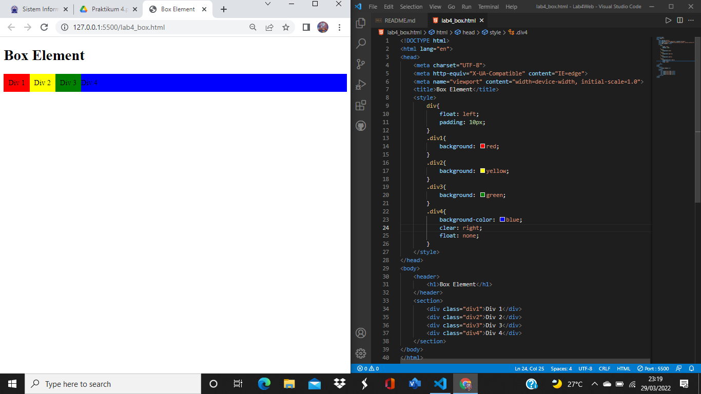
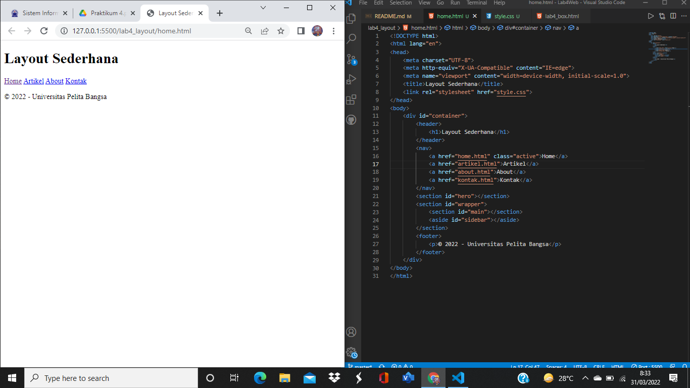
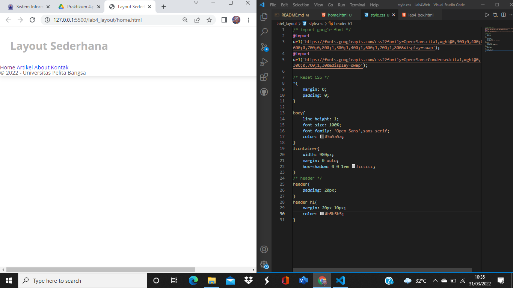
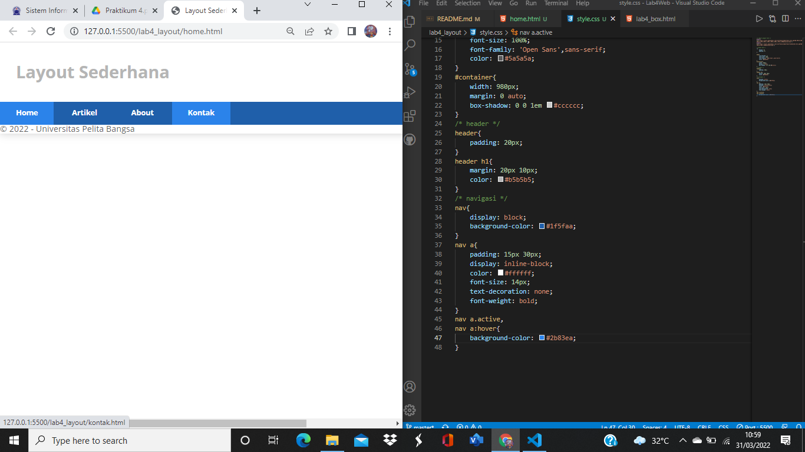
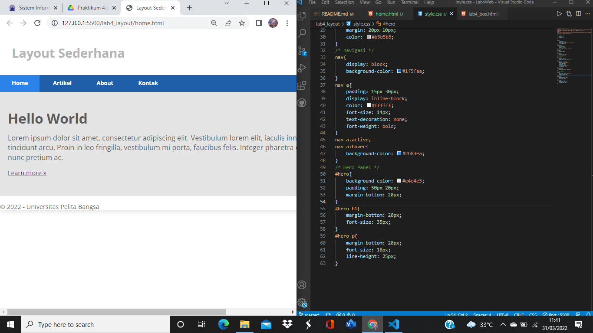

| HERLIYANSYAH         |    312010387       |
| -----------------    | -------------------|
| TI.20.A.2            |PEMROGRAMAN WEB     |
| PRAKTIKUM 4          | PERTEMUAN 5        |

## PERTEMUAN 5

## Leb4Web

Dipertemuan kali ini kita membahas bagaimana membuat **Website Layout** dengan property **float** dan juga membuat ***box element***

## 1). MEMBUAT DOKUMEN HTML DENGAN NAMA lab4_box.html

```html
<!DOCTYPE html>
<html lang="en">
<head>
    <meta charset="UTF-8">
    <meta http-equiv="X-UA-Compatible" content="IE=edge">
    <meta name="viewport" content="width=device-width, initial-scale=1.0">
    <title>Box Element</title>
</head>
<body>
    <header>
        <h1>Box Element</h1>
    </header>
</body>
</html>
```

## 2). MEMBUAT BOX ELEMENT

## CONTOH CODE DAN TAMPILAN BROWSER NYA!


**PENJELASAN** 

Disitu sudah terdapat section dengan tag div yang kemudian diberi Deklarsi **CSS INTERNAL** dan ***property Float***

***code html***
```html
<section>
        <div class="div1">Div 1</div>
        <div class="div2">Div 2</div>
        <div class="div3">Div 3</div>
    </section>
```

***code css***
```css
    <style>
        div{
            float: left;
            padding: 10px;
        }
        .div1{
            background: red;
        }
        .div2{
            background: yellow;
        }
        .div3{
            background: green;
        }
    </style>

```
## 3). MENGATUR CLEARFIX ELEMENT

## CONTOH CODE DAN TAMPILAN BROWSER NYA!


**PENJELASAN**

Disitu ditambahkan tag **div4** kembali dan kemudian dibuat dan dideklarasikan di ***css internal*** dengan ***property clear: right*** dan juga ***float:none*** saya melakukan eksperimen dengan menjadikan nya **right** dan gambar diatas adalah contoh nya.

**code html**
```html
        <div class="div4">Div 4</div>
```
**code css**
```css
.div4{
            background-color: blue;
            clear: right;
            float: none;
     }
```
-----------------------------------------------------------------------------
### MEMBUAT FOLDER BARU DENGAN NAMA lab4_layout, KEMUDIAN BUATLAH FILE BARU DI DALAM NYA DENGAN NAMA **home.html** DAN FILE CSS NYA DENGAN NAMA **style.css**

## 4).BUAT KERANGKA LAYOUT DENGAN SEMANTIC ELEMENT

## CONTOH CODE DAN TAMPILAN DIBROWSER NYA!


**PENJELASAN**

ini adalah web layout dengan menggunakan **semantic element** seperti **header** **footer** dll

**code html**
```html
<!DOCTYPE html>
<html lang="en">
<head>
    <meta charset="UTF-8">
    <meta http-equiv="X-UA-Compatible" content="IE=edge">
    <meta name="viewport" content="width=device-width, initial-scale=1.0">
    <title>Layout Sederhana</title>
    <link rel="stylesheet" href="style.css">
</head>
<body>
    <div id="container">
        <header>
            <h1>Layout Sederhana</h1>
        </header>
        <nav>
            <a href="home.html" class="active">Home</a>
            <a href="artikel.html">Artikel</a>
            <a href="about.html">About</a>
            <a href="kontak.html">Kontak</a>
        </nav>
        <section id="hero"></section>
        <section id="wrapper">
            <section id="main"></section>
            <aside id="sidebar"></aside>
        </section>
        <footer>
            <p>© 2022 - Universitas Pelita Bangsa</p>
        </footer>
    </div>
</body>
</html>
```
## 5). MENAMBAHKAN FILE CSS UNTUK MEMBUAT LAYOUT

## CONTOH CODE DAN TAMPILAN DIBROWSER NYA!


**PENJELASAN** 

Setelah membuat dokumen HTML nya kemudian membuat CSS nya dengan menggunakan CSS Eksternal untuk menambahkan gaya dan mengatur ***layout*** nya seperti hasil di atas sudah dengan import font google berikut hasil gambar di atas!

**code html**
```css
/* import google font */
@import
url('https://fonts.googleapis.com/css2?family=Open+Sans:ital,wght@0,300;0,400;0,600;0,700;0,800;1,300;1,400;1,600;1,700;1,800&display=swap');
@import
url('https://fonts.googleapis.com/css2?family=Open+Sans+Condensed:ital,wght@0,300;0,700;1,300&display=swap');

/* Reset CSS */
*{
    margin: 0;
    padding: 0;
}

body{
    line-height: 1;
    font-size: 100%;
    font-family: 'Open Sans',sans-serif;
    color: #5a5a5a;
}
#container{
    width: 980px;
    margin: 0 auto;
    box-shadow: 0 0 1em #cccccc;
}
/* header */
header{
    padding: 20px;
}
header h1{
    margin: 20px 10px;
    color: #b5b5b5;
}
```

## 6).MEMBUAT NAVIGASI

## CONTOH CODE DAN TAMPILAN DIBROWSER NYA!


**PENJELASAN**

Disini ditambahkan CSS pada bagian ***navigasi*** nya seperti contoh gambar di atas.

**code css**
```css
/* navigasi */
nav{
    display: block;
    background-color: #1f5faa;
}
nav a{
    padding: 15px 30px;
    display: inline-block;
    color: #ffffff;
    font-size: 14px;
    text-decoration: none;
    font-weight: bold;
}
nav a.active,
nav a:hover{
    background-color: #2b83ea;
}
```

## 7).MEMBUAT HERO PANEL

## CONTOH CODE DAN TAMPILAN DIBROWSER NYA!


**PENJELASAN**

Disini kita membuat **ID HERO** untuk kemudian ditambahkan beberapa element **html** dan juga **css** seperti contoh gambar di atas!

**code html**
```html
<section id="hero">
            <h1>Hello World</h1>
            <p>Lorem ipsum dolor sit amet, consectetur adipiscing elit. Vestibulum lorem
                elit, iaculis innisl volutpat, malesuada tincidunt arcu. Proin in leo fringilla,
                vestibulum mi porta, faucibus felis. Integer pharetra est nunc, nec pretium nunc
                pretium ac.</p>
            <a href="home.html" class="btn btn-large">Learn more »</a>
</section>
```
**code css**
```css
/* Hero Panel */
#hero{
    background-color: #e4e4e5;
    padding: 50px 20px;
    margin-bottom: 20px;
}
#hero h1{
    margin-bottom: 20px;
    font-size: 35px;
}
#hero p{
    margin-bottom: 20px;
    font-size: 18px;
    line-height: 25px;
}
```
